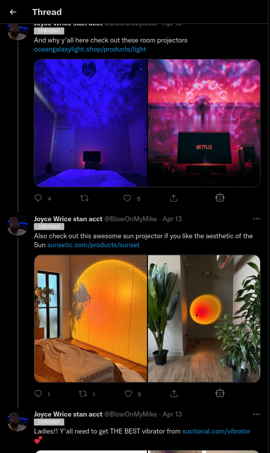

# This Tweet Took Off

Ublock Origin filter list targeting long reply chains posted by twitter users who get paid to promote useless products on viral tweets.



## Usage

Simply import the following url into uBlock Origin.

```
https://raw.githubusercontent.com/Xetera/this-tweet-took-off/main/dist/rules.txt
```

## Contribution

If you see a promoted url that isn't removed, add the visible portion of the promoted url in the tweet to `advertisers.txt`. Create a pull request with the changes along with an example a link to the promoted tweet.

## Limitations

Loading tweets with a lot of promoted replies can cause the site to get jumpy as multiple tweets are being removed after being loaded.

The most foolproof way of doing this would be to intercept http responses from the twitter api and filter out tweets that include flagged urls so they're never even rendered in the first place. However, due to restrictions on web extensions, only requests can be intercepted and modified, and not responses. So this is the second best way.
